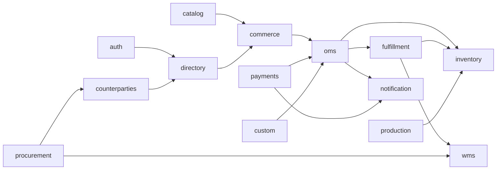

# Требования к API и контрактам микросервисов

> **Подробные требования по каждому сервису** (домен, сущности, эндпоинты, события, интеграции, приёмка): каталог [`docs/microservices/README.md`](microservices/README.md) — файлы `01-auth.md` … `14-notification.md`.

Документ ниже задаёт **сквозные правила** для HTTP API и **краткие по-сервисные ожидания** для 14 бэкендов ZhuchkaKeyboards. Edge — **Traefik**; отдельного API Gateway-приложения нет: маршрутизация и TLS на входе, доменные сервисы — за ним.

Соответствие папкам в репозитории: `services/auth`, `services/directory`, `services/catalog`, … (см. `docs/microservices-fine-split.md`).

---

## 1. Сквозные требования ко всем сервисам

### 1.1 Протокол и стиль

1. **Публичный контракт** — **HTTP/1.1 или HTTP/2**, **REST** как база: ресурсы во множественном числе, глаголы HTTP по смыслу (`GET`, `POST`, `PATCH`, `DELETE` где уместно).
2. **Версионирование API** — префикс пути: `/api/v1/...` (или `/v1/...` если принято единообразно во всех сервисах). Ломающие изменения — только новая мажорная версия (`v2`).
3. **OpenAPI 3.x** — для каждого сервиса актуальная спека (в репозитории сервиса или в общем MkDocs); схемы запросов/ответов и коды ошибок описаны явно.
4. **Формат тела** — `application/json`; кодировка UTF-8; даты в **ISO 8601** в UTC (`...Z`) или с явным offset.

### 1.2 Аутентификация и авторизация

1. Клиенты передают **`Authorization: Bearer <access_token>`** (OAuth2/OIDC), выданные **`auth-service`**. Сервисы **не** проверяют пароли; валидируют JWT (JWKS) или используют интроспекцию по политике безопасности.
2. **Разделение аудиторий**: отдельные OAuth client’ы / **scopes** для публичного фронта, операционного фронта, сервис-сервис вызовов. Каждый эндпоинт документирует минимально необходимые scopes / роли.
3. **Сервис-сервис**: `client_credentials` или внутренние mTLS/JWT с коротким TTL; не использовать «общий секрет» в заголовке без ротации и аудита.

### 1.3 Идемпотентность

1. Для **POST**, создающих платежи, заказы, резервы, движения склада, исходящие уведомления — поддержка **`Idempotency-Key`** (заголовок) или идempotency по бизнес-ключу в теле; повтор запроса с тем же ключом не должен дублировать побочный эффект.
2. Ответы идемпотентных операций: тот же идентификатор созданной сущности и согласованный статус.

### 1.4 Ошибки

1. Единый **envelope** ошибки (рекомендуется): `code`, `message`, `details` (опционально), `request_id` / `trace_id`.
2. HTTP-коды: `400` валидация, `401` не аутентифицирован, `403` нет прав, `404` не найдено, `409` конфликт состояния, `412` предусловие, `422` семантика домена (если отделить от 400), `429` rate limit, `500` внутренняя ошибка.
3. **Не утекать** в ответ внутренние стеки в production; детали — в логах по `request_id`.

### 1.5 Пагинация, фильтрация, сортировка

1. **Курсорная пагинация** предпочтительна для больших списков: `cursor` + `limit` (или `after`/`before`). Offset/limit допустим для малых справочников с оговоркой по производительности.
2. Фильтры и сортировка — явные query-параметры; стабильный порядок по умолчанию (например `id` или `created_at`).

### 1.6 Корреляция и наблюдаемость

1. Поддержка входящих заголовков **`X-Request-Id`** / **`traceparent`** (W3C); проброс в исходящие вызовы и в логи.
2. **`GET /health/live`**, **`GET /health/ready`** (или эквивалент): liveness без зависимостей, readiness с проверкой БД/Redis при необходимости.
3. **`GET /metrics`** — Prometheus; единые имена метрик по конвенции сервиса.

### 1.7 События (асинхронный контур)

1. Где указано «события» — контракт **схемы** (JSON Schema / Avro / аналог), **версия** события, **идемпотентный** consumer по `event_id`.
2. Рекомендуется **outbox** в сервисе-источнике и доставка в брокер отдельным процессом.

### 1.8 Безопасность и данные

1. **PCI**: полные PAN/CVC не логировать и не хранить вне `payments-service` по правилам PCI.
2. ПДн — минимизация в ответах; маскирование в логах.

---

Ниже — **по сервисам**: зона ответственности, базовый префикс API, ключевые ресурсы и операции, интеграции, события.

---

## 2. `auth-service` (`services/auth`)

**Назначение:** OAuth2/OIDC Authorization Server, пользователи, клиенты, роли/права (RBAC), сессии/refresh, MFA, JWKS, аудит входов.

**Аудитории входа:** **покупатель (витрина)** — вход через **Google (Gmail)** и **Telegram** (OIDC/виджет + проверка на бэкенде), отдельный OAuth client; **сотрудник (операционка)** — **только** выданная организацией учётка (логин/пароль и при необходимости MFA/корпоративный SSO), **без** входа через Telegram/Google как у витрины. Подробно: `docs/microservices/01-auth.md`, раздел 2.

| Область | Требования |
|--------|------------|
| **API** | OAuth2/OIDC: `authorize`, `token`, `revoke`, `userinfo` (если применимо), **JWKS** (`/.well-known/jwks.json` или путь из discovery), **OpenID discovery** (`.well-known/openid-configuration`). Управление: CRUD пользователей (админ), клиенты, роли, назначения ролей, опционально MFA enrollment. |
| **Аутентификация входящих** | Админ/API управления — по токену с высокими правами или отдельный mTLS; публичные OAuth-эндпоинты — rate limiting на Traefik. |
| **Идемпотентность** | Регистрация клиентов и критичные изменения — идемпотентные ключи или идempotent по client_id. |
| **События (исходящие)** | `UserCreated`, `UserLocked`, `LoginSuccess`, `LoginFailure` (для SIEM/аналитики). |
| **Зависимости** | БД auth; опционально Redis для сессий/rate limit; внешний IdP для SSO. |

---

## 3. `directory` / customer-service (`services/directory`)

**Назначение:** профили B2C/B2B, адреса, согласия (ПДн); связь с `sub` из Auth.

| Область | Требования |
|--------|------------|
| **API** | `/api/v1/customers` или `/profiles`: CRUD профиля по `subject`/внутреннему id; адреса; согласия с версиями и timestamp; B2B-профиль и привязка к контрагенту (ссылка на `counterparties-service`). |
| **Авторизация** | Пользователь видит только свой профиль; персонал — по ролям и scope. |
| **События** | `CustomerProfileUpdated`, `ConsentChanged`. |
| **Зависимости** | Auth (идентификация); чтение контрагента — API `counterparties-service`. |

---

## 4. `catalog-service` (`services/catalog`)

**Назначение:** каталог + PIM: товары, варианты, атрибуты, медиа, SEO/read-модели, **совместимость** (клавиатуры), поиск в контуре сервиса.

| Область | Требования |
|--------|------------|
| **API** | Продукты/варианты (`/products`, `/variants`), атрибуты, категории, медиа (метаданные + URL в объектном хранилище), **правила совместимости** (CRUD + evaluate API для конфигуратора). Поиск: `GET /search` или отдельный read-эндпоинт с query/facets. |
| **Публичное vs админ** | Публичные read-only эндпоинты для витрины (кэширование на CDN/Traefik); изменения — только с операционными scopes. |
| **События** | `ProductPublished`, `ProductUpdated`, `CompatibilityRulesChanged`. |
| **Зависимости** | Файлы — S3-совместимое хранилище; опционально поисковый индекс внутри сервиса. |

---

## 5. `commerce-service` (`services/commerce`)

**Назначение:** корзина, чекаут, промо/купоны, расчёт доставки/налогов на чекауте, создание **заказа продажи** (инициация в OMS).

| Область | Требования |
|--------|------------|
| **API** | `/carts` (сессия или пользователь), позиции корзины с привязкой к вариантам каталога; **validate** конфигурации; **checkout** — расчёт итогов, применение промо; создание заказа (передача в OMS). |
| **Идемпотентность** | **Обязательна** на `checkout` / `create-order` (`Idempotency-Key`). |
| **События** | `CartAbandoned` (опционально), `CheckoutInitiated`, `OrderDraftCreated` (до оплаты). |
| **Зависимости** | Catalog (цены, совместимость), OMS (создание заказа), Directory (адрес), опционально `custom-service` для кастом-спецификаций. |

---

## 6. `payments-service` (`services/payments`)

**Назначение:** эквайринг — платёжные интенты, webhooks провайдера, возвраты; **PCI** и секреты только здесь.

| Область | Требования |
|--------|------------|
| **API** | `POST /payment-intents`, подтверждение, статус; **webhooks** от провайдера (верификация подписи); возвраты; **не** отдавать наружу сырые данные карты. |
| **Идемпотентность** | Все денежные операции — строго идемпотентны по ключу или `idempotency_key` в теле. |
| **События** | `PaymentAuthorized`, `PaymentCaptured`, `PaymentFailed`, `RefundCompleted`. |
| **Зависимости** | Внешний PSP; OMS/commerce для связки с заказом. |

---

## 7. `oms-service` (`services/oms`)

**Назначение:** заказ продажи — строки, статусы жизненного цикла для клиента и цеха, связь с оплатой.

| Область | Требования |
|--------|------------|
| **API** | CRUD заказа (в границах политики), строки, статусы, история переходов; привязка `payment_id` / статуса оплаты; отмена по правилам. |
| **События** | `OrderCreated`, `OrderPaid`, `OrderCancelled`, `OrderStatusChanged` — для fulfillment, inventory, notifications. |
| **Зависимости** | Commerce (создание), Payments, Catalog (снимки позиций), опционально Custom. |

---

## 8. `fulfillment-service` (`services/fulfillment`)

**Назначение:** после оплаты — резерв/аллокация, волны, отгрузки, перевозчики, трек до клиента, возвраты/RMA.

| Область | Требования |
|--------|------------|
| **API** | Задачи отгрузки, партии/волны, этикетки, трек-номера; интеграции с перевозчиками (исходящие вызовы + webhooks); RMA/возвраты. |
| **События** | `ShipmentCreated`, `ShipmentShipped`, `DeliveryUpdated`, `RmaOpened`. |
| **Зависимости** | OMS, Inventory/WMS (аллокация), Notifications. |

---

## 9. `inventory-service` (`services/inventory`)

**Назначение:** **источник истины по количествам**: остатки, движения, резервы.

| Область | Требования |
|--------|------------|
| **API** | Остатки по SKU/локации; резервирование/снятие резерва; списание/приход; аудит движений; запрет отрицательных остатков по политике. |
| **Идемпотентность** | Операции движения — идемпотентны по ключу или бизнес-id движения. |
| **События** | `StockReserved`, `StockReleased`, `StockAdjusted`, `LowStock`. |
| **Зависимости** | OMS/Fulfillment/Production/Procurement — только через чёткие API/события. |

---

## 10. `wms-service` (`services/wms`)

**Назначение:** склады, зоны, ячейки, операции приёмки/отбора/размещения, инвентаризации.

| Область | Требования |
|--------|------------|
| **API** | Справочник складов/зон/ячеек; задания (tasks) на отбор/размещение; подтверждение сканом; циклическая инвентаризация. |
| **События** | `InboundCompleted`, `PickCompleted`, `InventoryCountPosted`. |
| **Зависимости** | Inventory (финальные количественные изменения согласованы с движениями); Procurement (ожидаемые приходы). |

---

## 11. `production-service` (`services/production`)

**Назначение:** производственные заказы, этапы, ресурсы, ОТК/брак.

| Область | Требования |
|--------|------------|
| **API** | Производственные заказы, маршруты/этапы, статусы, учёт брака, загрузка цеха (по необходимости). |
| **События** | `WorkOrderReleased`, `StepCompleted`, `ScrapRecorded`, `ProductionCompleted`. |
| **Зависимости** | OMS/Custom (что собирать), Inventory (списание компонентов), WMS (задачи на линии/складе). |

---

## 12. `custom-service` (`services/custom)

**Назначение:** конфигуратор (валидация, цена черновика), BOM, согласования с клиентом, связь с OMS/production.

| Область | Требования |
|--------|------------|
| **API** | Конфигурации, расчёт цены/срока черновика, BOM-дерево, статусы согласования, привязка к заказу OMS. |
| **События** | `CustomSpecSubmitted`, `CustomSpecApproved`, `BomFinalized`. |
| **Зависимости** | Catalog (совместимость), Commerce/OMS, Production, Inventory. |

---

## 13. `procurement-service` (`services/procurement`)

**Назначение:** закупки — заявки, PO, входящие поставки, приёмка (GRN), трекинг входящих отправок.

| Область | Требования |
|--------|------------|
| **API** | Заявки на закупку, PO и строки, ожидаемые поставки, трек, статусы; **goods receipt** и согласование с количеством; опционально сверка со счётом поставщика. |
| **События** | `PurchaseOrderSent`, `InboundShipmentUpdated`, `GoodsReceived`. |
| **Зависимости** | Counterparties (поставщик), WMS/Inventory (приход на склад). |

---

## 14. `counterparties-service` (`services/counterparties`)

**Назначение:** контрагенты — юрлица, договоры, реквизиты; связи с закупками и B2B.

| Область | Требования |
|--------|------------|
| **API** | CRUD контрагентов, договоры, банковские реквизиты, роли (поставщик, клиент B2B, перевозчик); ссылки из других сервисов по стабильным id. |
| **События** | `CounterpartyUpdated`, `ContractActivated` (по необходимости). |
| **Зависимости** | Минимальные; потребители — Procurement, Directory, Fulfillment. |

---

## 15. `notification-service` (`services/notification`)

**Назначение:** шаблоны, очередь, каналы (email/SMS/push/webhook) — адаптеры по каналам как модули.

| Область | Требования |
|--------|------------|
| **API** | Отправка уведомления по типу и payload; управление шаблонами; статусы доставки; **идемпотентность** по `notification_key` для защиты от дублей. |
| **События (входящие)** | Подписка на доменные события из OMS/Payments/Fulfillment и т.д. (через брокер) с маппингом на шаблоны. |
| **Зависимости** | Внешние провайдеры каналов; очередь/брокер. |

---

## 16. Матрица синхронных зависимостей (упрощённо)

*(На практике часть связей должна идти через **события**, не синхронные цепочки.)*

---

## 17. Критерии готовности API сервиса к интеграции

- [ ] OpenAPI опубликован, версия `v1` зафиксирована.
- [ ] Описаны scopes/роли для защищённых эндпоинтов.
- [ ] Health/metrics доступны; ошибки в едином формате.
- [ ] Идемпотентность для операций с деньгами, складом и доставкой — где применимо.
- [ ] События с версией схемы и политикой совместимости.

---

*Документ дополняется по мере детализации OpenAPI и выбора брокера сообщений; изменения согласовывать с `docs/architecture-and-domain-thoughts.md`.*
