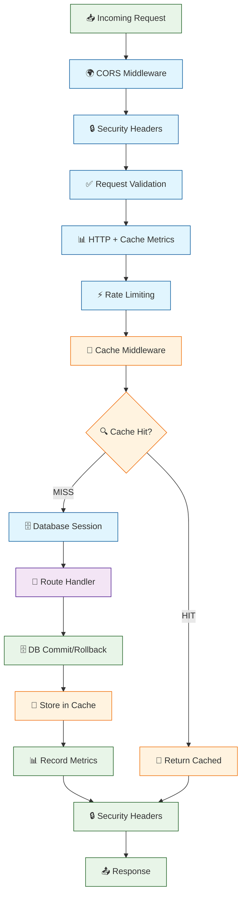
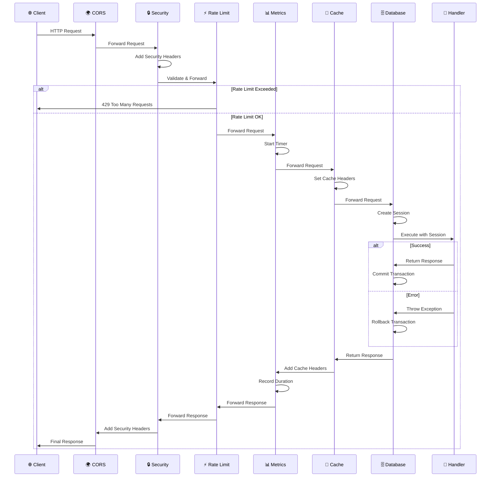
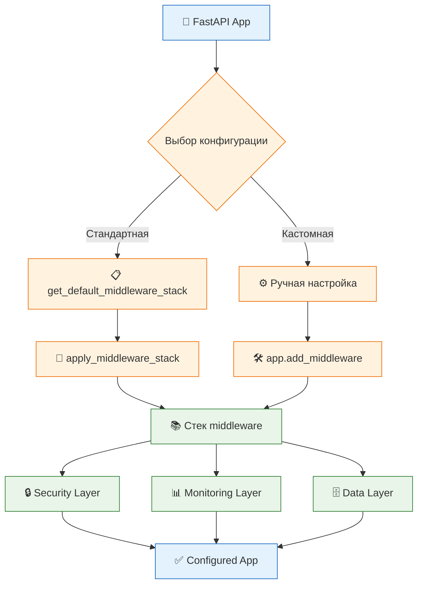
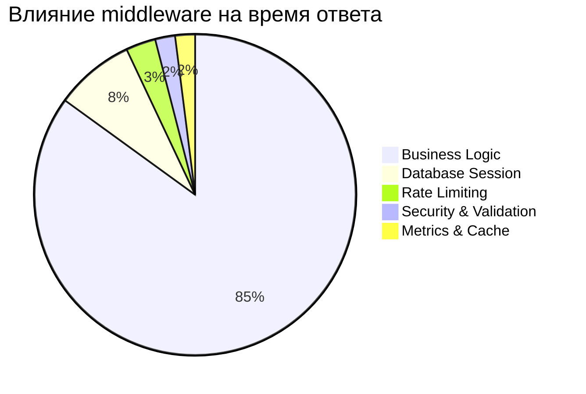
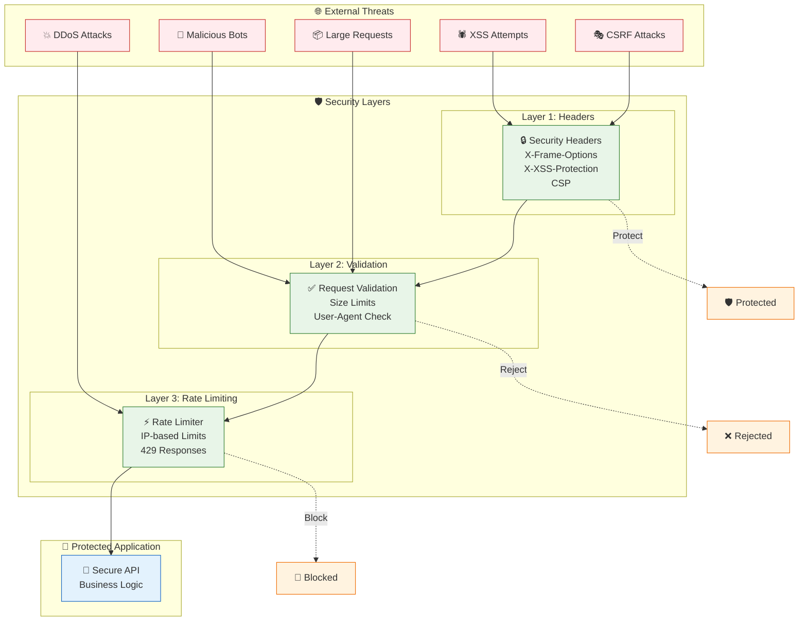
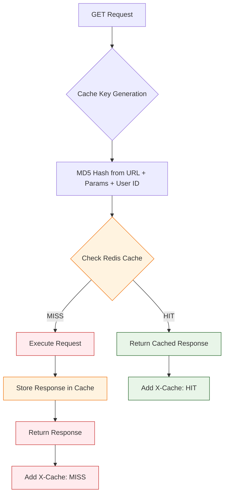

# Middleware Documentation

Централизованная система middleware для ZhuchkaKeyboards Gateway API.

## Архитектура middleware



## Структура файлов

```
middleware/
├── __init__.py              # Централизованный импорт и управление стеком
├── rate_limiter.py          # Rate limiting по IP
├── database.py              # Управление сессиями БД
├── metrics.py               # Сбор HTTP метрик
├── security.py              # Security headers и валидация
├── cache_middleware.py      # Кеширование (существующий)
└── README.md               # Документация
```

## Порядок применения middleware

Middleware применяются в определенном порядке, который важен для правильной работы:

1. **SecurityHeadersMiddleware** - добавляет security headers (XSS, CSRF protection)
2. **RequestValidationMiddleware** - валидация входящих запросов (размер, User-Agent)
3. **HTTPMetricsMiddleware** - сбор HTTP и cache метрик (самый внешний для полного покрытия!)
4. **RateLimiterMiddleware** - ограничение частоты запросов по IP (DDoS protection)
5. **CacheMiddleware** - кэширование GET-запросов в Redis (TTL: 300s)
6. **DBSessionMiddleware** - управление транзакциями БД (должен быть последним)

## Компоненты middleware

```mermaid
graph LR
    subgraph "Security Layer"
        SH[🔒 Security Headers<br/>XSS, CSRF Protection]
        RV[✅ Request Validation<br/>Size, User-Agent]
        RL[⚡ Rate Limiter<br/>DDoS Protection]
    end
    
    subgraph "Monitoring Layer"
        HM[📊 HTTP Metrics<br/>Performance Tracking]
        CC[💾 Cache Control<br/>Response Headers]
    end
    
    subgraph "Data Layer"
        DB[🗄️ Database Session<br/>Transaction Management]
    end
    
    subgraph "Business Logic"
        API[🎯 API Handlers<br/>Business Logic]
    end
    
    Request --> SH
    SH --> RV
    RV --> RL
    RL --> HM
    HM --> CC
    CC --> DB
    DB --> API
    
    classDef security fill:#ffebee,stroke:#c62828
    classDef monitoring fill:#e3f2fd,stroke:#1565c0
    classDef data fill:#f3e5f5,stroke:#7b1fa2
    classDef business fill:#e8f5e8,stroke:#2e7d32
    
    class SH,RV,RL security
    class HM,CC monitoring
    class DB data
    class API business
```



## Последовательность обработки запроса



## Описание middleware

### RateLimiterMiddleware

Защищает от DDoS атак, ограничивая количество запросов с одного IP адреса.

**Параметры:**
- `max_requests` - максимальное количество запросов в временном окне (по умолчанию: 999999)
- `time_window` - временное окно в секундах (по умолчанию: 60)

**Особенности:**
- Автоматическая очистка старых записей
- Возвращает HTTP 429 при превышении лимита
- Добавляет header `Retry-After`

### DBSessionMiddleware

Автоматически управляет сессиями базы данных для каждого запроса.

**Функциональность:**
- Создает новую сессию для каждого запроса
- Автоматически коммитит транзакцию при успешном выполнении
- Откатывает транзакцию при ошибке
- Всегда закрывает сессию в блоке `finally`

**Доступ к сессии:**
```python
from fastapi import Request

async def my_handler(request: Request):
    session = request.state.db  # AsyncSession
```

### HTTPMetricsMiddleware

Собирает базовые метрики HTTP запросов для мониторинга.

**Собираемые метрики:**
- `http_requests_total` - общее количество запросов (по методам, эндпоинтам, статус кодам)
- `http_request_duration_seconds` - время выполнения запросов

**Эндпоинт метрик:**
```bash
GET /metrics  # Prometheus format
```

### SecurityHeadersMiddleware

Добавляет важные security headers ко всем ответам.

**Добавляемые headers:**
- `X-Content-Type-Options: nosniff`
- `X-Frame-Options: DENY` 
- `X-XSS-Protection: 1; mode=block`
- `Referrer-Policy: strict-origin-when-cross-origin`
- `Content-Security-Policy: default-src 'self'`

### RequestValidationMiddleware

Выполняет базовую валидацию входящих запросов.

**Проверки:**
- Максимальный размер запроса (по умолчанию: 10MB)
- Блокировка подозрительных User-Agent (сканеры, боты)
- Разрешение известных ботов (Googlebot, Bingbot, etc.)

## Использование

### Схема подключения middleware



### Стандартное применение

```python
from fastapi import FastAPI
from middleware import apply_middleware_stack

app = FastAPI()

# Применяем стандартный стек middleware
apply_middleware_stack(app)
```

### Кастомная конфигурация

```python
from middleware import (
    RateLimiterMiddleware,
    DBSessionMiddleware, 
    HTTPMetricsMiddleware
)

app = FastAPI()

# Добавляем middleware вручную
app.add_middleware(DBSessionMiddleware)
app.add_middleware(HTTPMetricsMiddleware)
app.add_middleware(RateLimiterMiddleware, max_requests=1000, time_window=60)
```

### Получение конфигурации стека

```python
from middleware import get_default_middleware_stack

# Получаем стандартную конфигурацию
middleware_stack = get_default_middleware_stack()

# Модифицируем для конкретных нужд
for middleware_config in middleware_stack:
    if middleware_config["middleware"].__name__ == "RateLimiterMiddleware":
        middleware_config["kwargs"]["max_requests"] = 100

# Применяем модифицированный стек
apply_middleware_stack(app, middleware_stack)
```

## Мониторинг и отладка

### Логирование

Все middleware используют централизованную систему логирования:

```python
from utils.logger import get_logger

logger = get_logger(__name__)
logger.info("Middleware applied successfully")
```

### Метрики

HTTP метрики доступны через эндпоинт `/metrics` в формате Prometheus.

### Health Checks

Middleware автоматически интегрируются с системой health checks через:
- Database session management
- Metrics collection
- Security validation

## Добавление нового middleware

1. Создайте новый файл в папке `middleware/`
2. Унаследуйте от `BaseHTTPMiddleware`
3. Добавьте в `__init__.py` для импорта
4. Обновите `get_default_middleware_stack()` если нужно включить в стандартный стек

**Пример нового middleware:**

```python
# middleware/my_middleware.py
from starlette.middleware.base import BaseHTTPMiddleware
from fastapi import Request

class MyCustomMiddleware(BaseHTTPMiddleware):
    def __init__(self, app, custom_param: str = "default"):
        super().__init__(app)
        self.custom_param = custom_param

    async def dispatch(self, request: Request, call_next):
        # Логика до обработки запроса
        
        response = await call_next(request)
        
        # Логика после обработки запроса
        
        return response
```

```python
# middleware/__init__.py
from .my_middleware import MyCustomMiddleware

__all__ = [
    # ... existing middleware ...
    "MyCustomMiddleware",
]
```

## Производительность

### Диаграмма производительности middleware

```mermaid
gantt
    title Время выполнения middleware (микросекунды)
    dateFormat X
    axisFormat %s μs
    
    section Security
    Security Headers    :0, 50
    Request Validation  :50, 100
    
    section Rate Limiting
    Rate Check         :100, 200
    
    section Monitoring
    Metrics Start      :200, 250
    Cache Headers      :250, 300
    
    section Database
    Session Create     :300, 500
    Business Logic     :500, 5000
    Transaction        :5000, 5100
    
    section Response
    Metrics Record     :5100, 5150
    Response Headers   :5150, 5200
```



### Impact на производительность



### Оптимизация

- Middleware применяются в порядке стека - самые важные должны быть первыми
- Избегайте тяжелых операций в middleware
- Используйте async/await для всех I/O операций
- Кешируйте результаты когда возможно

### Профилирование

Используйте HTTPMetricsMiddleware для отслеживания производительности:

```bash
# Проверка метрик производительности
curl http://localhost:8001/metrics | grep http_request_duration
```

## Безопасность

### Архитектура безопасности



### Матрица защиты

```mermaid
graph LR
    subgraph "Угрозы vs Защита"
        direction TB
        
        subgraph "🎯 Атаки"
            A1[DDoS]
            A2[XSS]
            A3[CSRF]
            A4[Injection]
            A5[Large Payload]
            A6[Bot Traffic]
        end
        
        subgraph "🛡️ Middleware"
            M1[Rate Limiter]
            M2[Security Headers]
            M3[Request Validation]
        end
        
        A1 -.->|Защищает| M1
        A2 -.->|Защищает| M2
        A3 -.->|Защищает| M2
        A4 -.->|Частично| M3
        A5 -.->|Защищает| M3
        A6 -.->|Защищает| M1
        A6 -.->|Защищает| M3
    end
```



### Best Practices

1. **SecurityHeadersMiddleware** должен применяться первым
2. **RequestValidationMiddleware** проверяет входящие данные
3. **RateLimiterMiddleware** защищает от DDoS
4. Всегда логируйте подозрительную активность
5. Регулярно обновляйте security правила

### Конфигурация для production

```python
# Production настройки для rate limiting
app.add_middleware(
    RateLimiterMiddleware, 
    max_requests=100,      # Более строгий лимит
    time_window=60
)

# Production настройки для request validation
app.add_middleware(
    RequestValidationMiddleware,
    max_request_size=5 * 1024 * 1024  # 5MB для production
)

# Production настройки для кэширования
app.add_middleware(
    CacheMiddleware,
    cache_ttl=300  # 5 минут TTL для production
)
```

## 💾 Cache Middleware

### Описание

`CacheMiddleware` обеспечивает автоматическое кэширование GET-запросов в Redis для улучшения производительности API.

### Функциональность

- **Автоматическое кэширование** — все GET-запросы кэшируются автоматически
- **Redis хранилище** — использует Redis для быстрого доступа к кэшу  
- **TTL управление** — настраиваемое время жизни кэша (по умолчанию 300s)
- **Персонализированный кэш** — учитывает user_id из сессий
- **Умная генерация ключей** — MD5 хэш от URL + параметров + заголовков
- **Content-Length исправления** — корректная обработка HTTP заголовков

### Архитектура кэширования



### Метрики кэширования

CacheMiddleware интегрирован с HTTPMetricsMiddleware и предоставляет метрики:

- **`gateway_http_requests_total{cache_status="HIT|MISS"}`** — запросы по статусу кэша
- **`gateway_http_request_duration_seconds{cache_status="HIT|MISS"}`** — время ответа 
- **`gateway_cache_requests_total{cache_status="HIT|MISS"}`** — счетчик кэш запросов
- **`gateway_cache_hit_ratio_total{endpoint="/api/path"}`** — коэффициент попаданий

### Производительность

| Тип запроса | Время ответа | Улучшение |
|-------------|-------------|-----------|
| Cache HIT   | ~0.005s     | **95%+ быстрее** |
| Cache MISS  | ~0.100s     | Базовая скорость |

### Конфигурация

```python
# Базовая конфигурация
app.add_middleware(
    CacheMiddleware,
    cache_ttl=300  # TTL в секундах
)

# Кастомная конфигурация
app.add_middleware(
    CacheMiddleware,
    cache_ttl=600  # 10 минут для долгого кэширования
)
```

### Особенности

1. **Только GET запросы** — POST/PUT/DELETE не кэшируются
2. **Статус коды 200, 201, 304** — только успешные ответы кэшируются
3. **No-cache заголовки** — если клиент передает `Cache-Control: no-cache`, кэширование пропускается
4. **Персонализация** — разные пользователи получают разные кэш ключи
5. **Graceful fallback** — при ошибках Redis работает без кэширования
